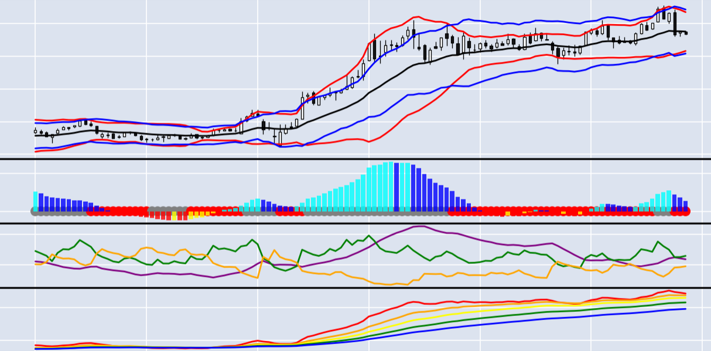
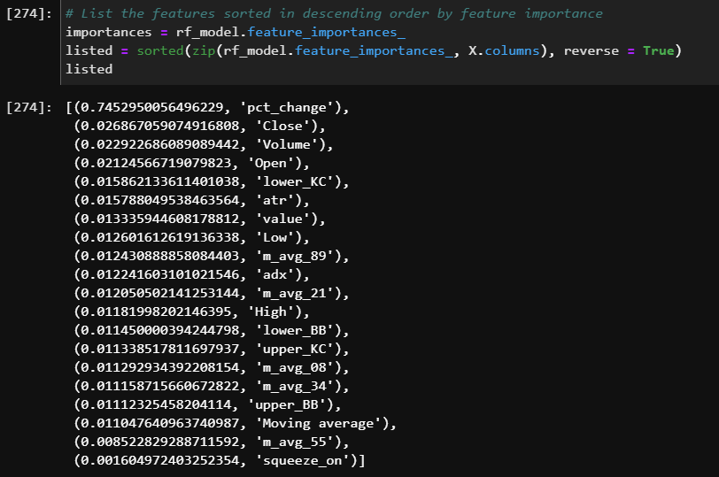
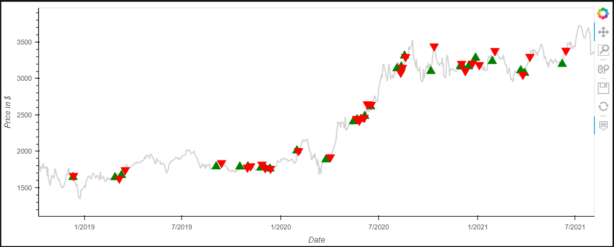

# Squeeze Me Baby One More Time
## _How Not To Be A FOMO Investor_

The sharp rises in stock prices from their 2020 pandemic lows and the avalability of FinTech investment Apps such as Robin Hood have combined to crate a growing class of retail investors. Some of these retail investors end up becoming ***FOMO Investors*** (Fear Of Missing Out). FOMO Investors find out about a big move the wave is about to crest,and the best opportunity for profits have passed. Not having all of the analytical respurces of large investment firms, retail investors are often at a disadvantage when it comes to timing.

Also, many of these retail investors shy away from some of the more popular stocks such as the FAANGs (Facebook, Apple, Amazon, Netflix and Google (Alphabet)), Tesla, Adobe or Square because of the high cost of purchasing even one share. For example, at the time of this writing, Facebook and Tesla are trading at hundreds of dollars a share, while Amazon and Google are trading at thousands of dollars a share.

There are opportunities to profit on big moves in these popular stocks. We are trying to determine the following questions.

- Is there a relatively easy way for retail investors to spot a pending big move in a popular stock?

- Would this method stand up to scrutiny by logistical regression and machine learning models?

- Is there a way for small retail investors to take an amount such as $1,000 and profit from big moves in popular stocks?

***"It is not in the thinking that the money is made. It is in the sitting and waiting,” said Jesse Livermore, a legendary stock trader.***

Timing is a big key to succesful stock trading.

## The TTM Squeeze

We decided to look at a technical market indicator called the TTM Squeeze. It was created by John Carter (he was at Trade The Markets which is where the TTM comes from, it is now called Simpler Trading.) 

The TTM Squeeze combines Bollinger Bands and Keltner Channels on a graph. When the Bollinger Bands are enclosed by the Keltner Channels, it indictes a period of low volatility: this is refferred to as the "Squeeze."

When the Bollinger Bands break outside of the Keltner Channels - it indicates prices breaking out of the trading range. The TTM Squeeze places the Bollinger Bands and Keltner Channels on top of a smoothed momentum osillator. The momentum histogram shows the direction of the momentum, indicating if it will be a price rise or drop.

While it is available to retail investors on various sites, we wrote our own code to generate a TTM Squeeze graph. We used daily price data from the past three years, taken from the Yahoo Finance API, for Amazon (AMZN) stock. 

We calculated the Bollinger Bands and then the Keltner Channels. Then we calculated the momentum and placed them all on a graph.

## Squeeze Through Random Forest Model

We ran the squeeze data through a Random Forest model. This allowed us to see which features are important for modeling. 

Our scores in the Random Forest model were good:

## Squeeze Through Linear Regression Model

Next we ran the squeeze information through a linear regression model. We got these results that showed a fairly close relationship between actual and predicted prices:

## Squeeze Profitability Prediction LSTM Model

Next, we ran the squeeze data through a machine learning model the Long Short-Term Memory model.

We used these parameters for this machine learning model:

Our actual vs predicted results running through the LSTM model were fairly close:

## Using Options Strategy

The TTM Squeeze appears a relatively reliable and accesible way for retail investors to time their trades. But how can they invest into some of these popular sticks which trade at high prices.

The answer is to not trade the actual stock, but to trade options on the stock. Each option controls 100 shares of a given stock. But the price of the options themselves are usually many multiples lower than the actual stock prices. By selecting option that are further "out of the money" or of a longer duration, lower price entry points can be achieved.

## Alogrithmic Trading Model

We created an Alogrithmic Trading model that would allow investors to see buy and sell points for otions based upon the squeeze. We only graphed when the momentum indicates an upward movement in the price for this exercise. Downward moves would work as well, but most retail investors are not comfortable with short selling. 

It yielded this graph:

The green "up" arrows are points to buy and the red "down" arrows are places to sell.

The retail investor can then go to a site such as Robin Hood or TD Ameritrade's ThinkorSwim and find an options trade that matches the direction the squeeze indicator suggests. Using this strategy, retail investors that catch big moves at the correct moment, and use graphs to know when to exit, can achieve good profits. 

For example, there is a time period in June-July 2021 when an investor who had timed Amazon correctly could have turned 1000 dollars into 30,000 dollars. That is the type of return many believe is only available from Meme stocks or crypto currencies.

The Squeeze strategy can work for trading crypto currencies as well, but the Crypto market is 24 hours a day and 7 days a week, requiring more monitoring. Also, there are not option trades available on crypto cureencies themselves, but you can buy and sell options of Crypto ETFs (Exchange Teaded Funds) which operate like mutual funds of crypto assets. 

## Conclusions

We come back to our original questions:

- Is there a relatively easy way for retail investors to spot a pending big move in a popular stock?

**Answer**: Yes. The TTM Squeeze is a model that can help retail investors time big moves. There are numerous no cost or low cost ways for investors to get Squeeze data in their preferred stock.

- Would this method stand up to scrutiny by logistical regression and machine learning models?

**Answer**: The TTM Squeeze stood up very well to scrutiny using the Random Forest model, the Linear Regression model and the LSTM machine learning model.

- Is there a way for small retail investors to take an amount such as $1,000 and profit from big moves in popular stocks?

**Answer**: Using the TTM Squeeze to predict big moves in stock prices can be combined with an options trading strategy. Trading in the options rather than in the actual stock can allow a retail investor to "play with the big boys and girls."

***NOTE: The two week time constraint of this project did not allow us to complete additional code that could be helpful. This code would take a starting investment of 1000 dollars at the start of 2021 and calculate what the return would be for 2021 to date, if an investor had used the strategy above. This may be done in a future project***

